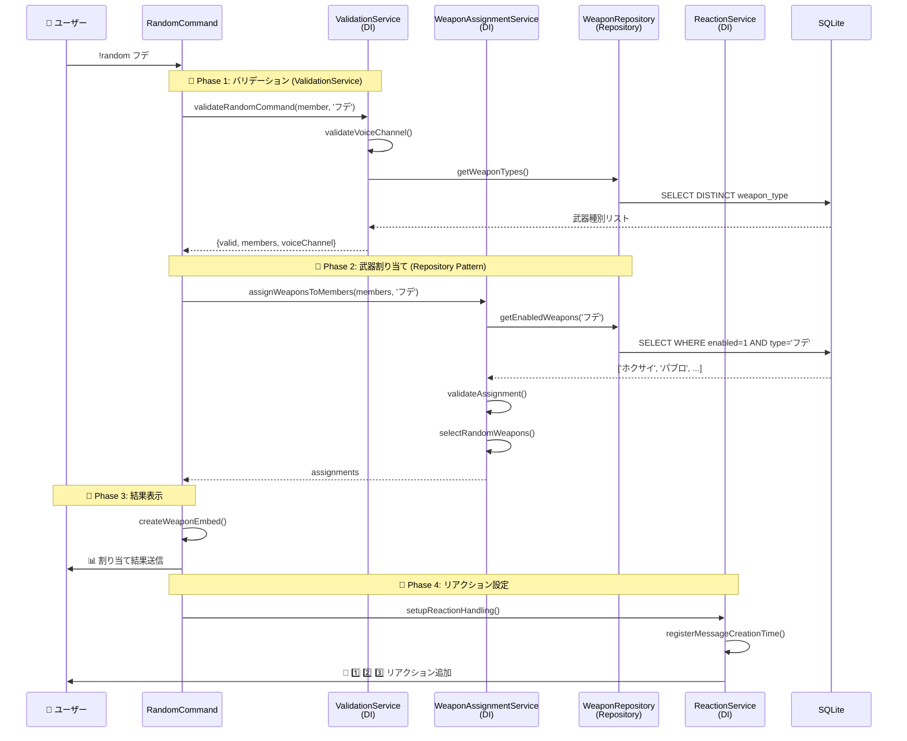
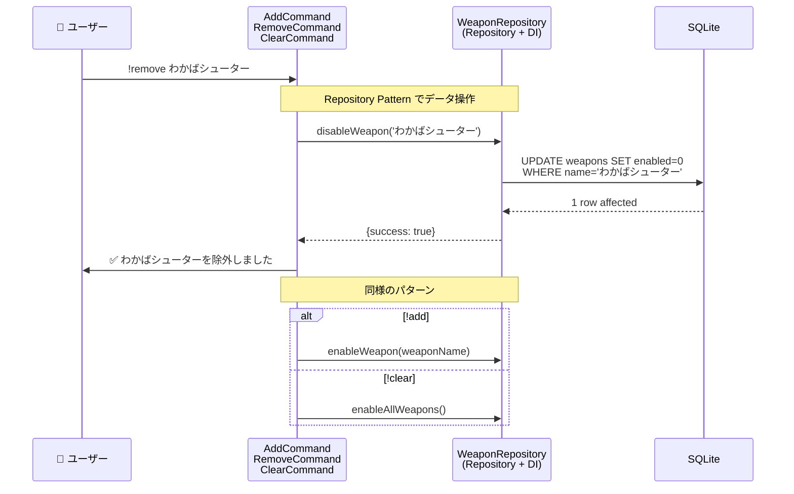
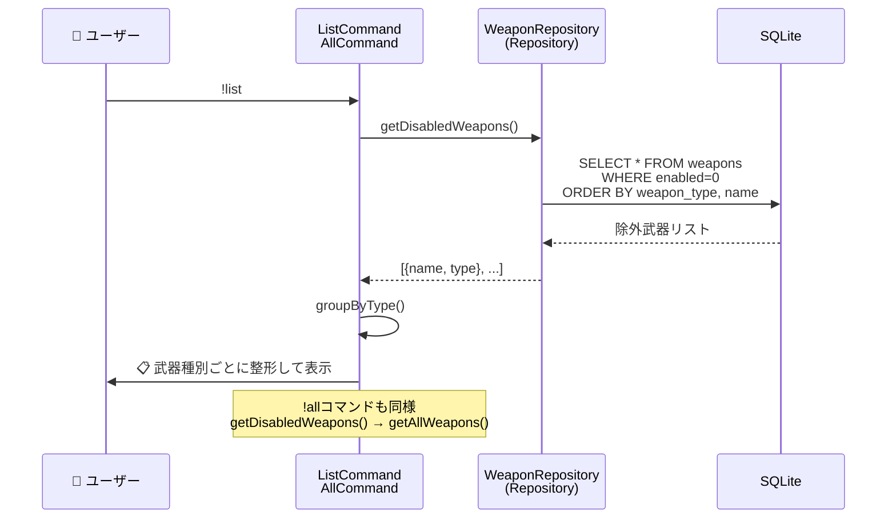
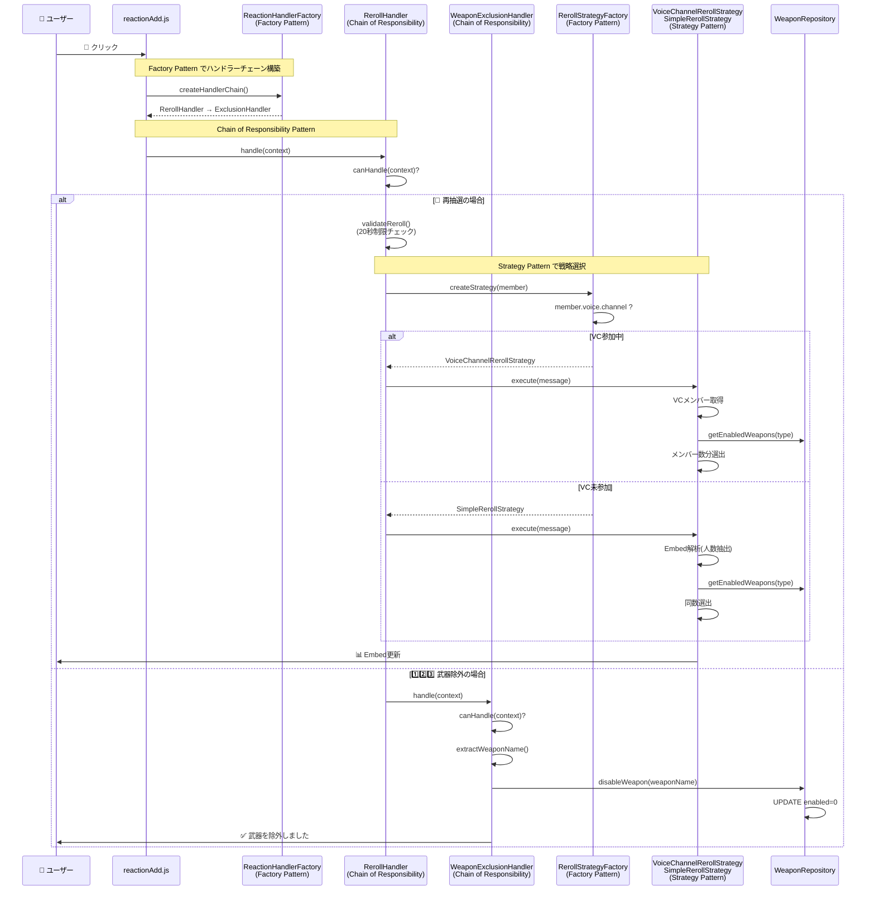
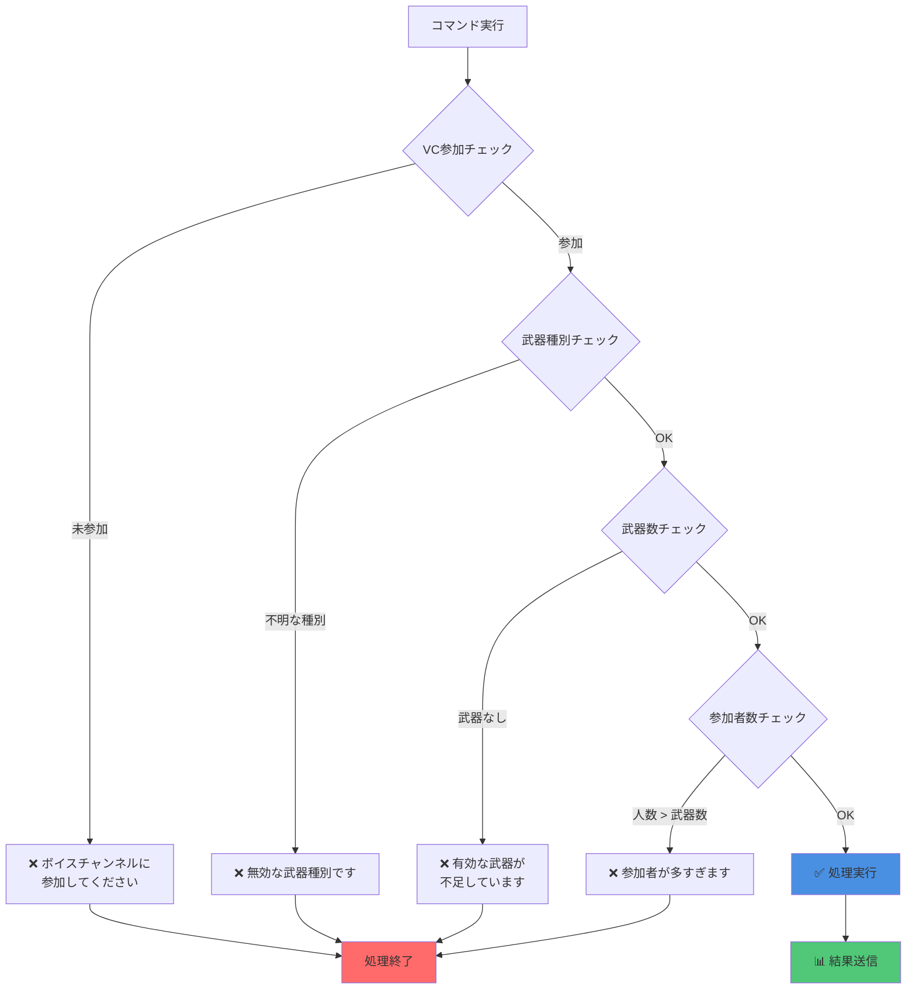

# 🎮 Splatoon 3 武器ランダム選出 Discord Bot

[](https://nodejs.org/)
[](https://discord.js.org/)
[](LICENSE)

Discordのボイスチャンネル参加者にSplatoon 3の武器をランダムに割り当てるBot。**SOLID原則**、**デザインパターン**を完全準拠した、保守性・拡張性・テスタビリティに優れたクリーンアーキテクチャ実装です。

## ✨ 機能

### 🎯 コア機能
- **ボイスチャンネル自動検出**: 参加者を自動で認識して武器を割り当て
- **武器除外システム**: 使いたくない武器を除外リストで管理
- **武器種別フィルタ**: シューター、フデなど種別指定で抽選可能
- **リアクション操作**: 🔄で再抽選、1️⃣2️⃣3️⃣で即座に武器除外

### 🔧 技術的特徴
- ✅ **SOLID原則完全準拠**
- ✅ **Dependency Injection（DI）**
- ✅ **Repository パターン**
- ✅ **Factory パターン**
- ✅ **Strategy パターン**
- ✅ **Chain of Responsibility パターン**
- ✅ **テスト駆動開発（TDD）**: 100+ テストケース

---

## 📋 コマンド一覧

| コマンド | 説明 | 例 |
|---------|------|-----|
| `!random [種別]` | ボイスチャンネル参加者に武器を選出 | `!random` / `!random フデ` |
| `!remove <武器/種別>` | 武器または武器種別を除外 | `!remove わかばシューター` |
| `!add <武器/種別>` | 除外を解除 | `!add わかばシューター` |
| `!list` | 除外中の武器一覧を表示 | `!list` |
| `!all` | 全武器一覧を表示 | `!all` |
| `!clear` | 除外リストをクリア | `!clear` |
| `!help` | ヘルプを表示 | `!help` |

### 対応武器種別
シューター / マニューバー / ブラスター / フデ / ローラー / スロッシャー / シェルター / スピナー / チャージャー / ストリンガー / ワイパー

---

## 🔄 コマンド別処理フロー

### 📍 !random コマンド

**使用デザインパターン**: Repository / Dependency Injection / Strategy / Factory

ボイスチャンネル参加者に武器をランダム割り当て。4つのフェーズで処理を実行します。



**デザインパターンの役割**:
- **Repository Pattern** (`WeaponRepository`): データアクセスを抽象化。テスト時はモックに差し替え可能
- **Dependency Injection**: コンストラクタで3つのサービスを注入。疎結合を実現
- **Strategy Pattern** (後続の再抽選で使用): VC参加状況に応じて戦略を動的選択

---

### 📍 !add / !remove / !clear コマンド

**使用デザインパターン**: Repository / Dependency Injection

武器除外リストを管理。シンプルなCRUD操作をRepository経由で実行します。



**デザインパターンの役割**:
- **Repository Pattern**: データベース操作を隠蔽。SQLの詳細をコマンド層から分離
- **Dependency Injection**: WeaponRepositoryをコンストラクタ注入。テスタビリティ向上

---

### 📍 !list / !all コマンド

**使用デザインパターン**: Repository / Dependency Injection

武器リストを表示。読み取り専用のクエリ操作です。



**デザインパターンの役割**:
- **Repository Pattern**: 複雑なSQLクエリ（ソート、フィルタ）をカプセル化
- **Dependency Injection**: WeaponRepositoryを注入。将来的に別データソースへの切り替えが容易

---

### 📍 リアクション処理（🔄 再抽選 / 1️⃣2️⃣3️⃣ 除外）

**使用デザインパターン**: Chain of Responsibility / Factory / Strategy

リアクションイベントを複数のハンドラーで処理。責任の連鎖パターンで拡張性を確保。



**デザインパターンの役割**:
- **Chain of Responsibility** (`RerollHandler` → `ExclusionHandler`): 
  - 各ハンドラーが処理可能か判定し、次のハンドラーに委譲
  - 新しいリアクション種別の追加が容易（Open/Closed Principle）
  
- **Factory Pattern** (`ReactionHandlerFactory`):
  - ハンドラーチェーンの構築ロジックを集約
  - テスト時にカスタムチェーンを注入可能
  
- **Factory Pattern** (`RerollStrategyFactory`):
  - VC参加状況に応じて適切な戦略を選択
  - 戦略の登録・切り替えが動的
  
- **Strategy Pattern** (`VoiceChannelRerollStrategy` / `SimpleRerollStrategy`):
  - 再抽選アルゴリズムを切り替え可能に
  - 各戦略が独立してテスト可能

---

### 🎯 エラーハンドリング

全コマンド共通のバリデーションフロー。早期リターンで可読性を確保。



---

## 🏗️ アーキテクチャ

### プロジェクト構造

```
src/
├── commands/              # コマンド層（UI層）
│   ├── random.js         # 武器ランダム選出（DIパターン）
│   ├── add.js            # 除外解除コマンド
│   ├── remove.js         # 除外追加コマンド
│   ├── list.js           # 除外リスト表示
│   ├── all.js            # 全武器リスト表示
│   ├── clear.js          # 除外リストクリア
│   └── help.js           # ヘルプ表示
│
├── services/             # ビジネスロジック層（Domain Service）
│   ├── WeaponAssignmentService.js  # 武器割り当てロジック
│   ├── ValidationService.js         # 入力検証
│   ├── ReactionService.js          # リアクション管理
│   └── MessageStateManager.js       # メッセージ状態管理
│
├── repositories/         # データアクセス層（Repository）
│   └── WeaponRepository.js         # 武器データ永続化
│
├── events/              # イベント処理層
│   ├── factories/       # オブジェクト生成（Factory）
│   │   ├── ReactionHandlerFactory.js  # ハンドラー構築
│   │   └── RerollStrategyFactory.js   # 戦略選択
│   ├── handlers/        # イベントハンドラー（Chain of Responsibility）
│   │   ├── ReactionHandler.js         # 基底ハンドラー
│   │   ├── RerollHandler.js          # 再抽選処理
│   │   └── WeaponExclusionHandler.js  # 武器除外処理
│   ├── strategies/      # 再抽選戦略（Strategy）
│   │   └── RerollStrategy.js
│   └── reactionAdd.js   # リアクションイベント統合
│
├── utils/               # ユーティリティ層
│   ├── constants.js     # 定数定義
│   ├── embedBuilder.js  # Discord Embed生成
│   ├── messageHelper.js # メッセージヘルパー
│   └── weaponSelector.js # 武器選択ロジック（Fisher-Yates）
│
├── data/                # ドメインモデル
│   └── weapons.js       # 武器マスターデータ（160武器）
│
├── db/                  # データベース層
│   ├── connection.js
│   ├── migrations/      # スキーマバージョン管理
│   └── seeds/          # 初期データ
│
└── index.js            # エントリーポイント
```

---
## 🧪 テスト

**100+ テストケースで品質保証**

```bash
npm test              # 全テスト実行
npm test -- random    # 特定テストのみ
```

### テストカバレッジ

| カテゴリ | テスト数 | 説明 |
|---------|---------|------|
| **Repository** | 11 | データアクセス層 |
| **Commands** | 14 | コマンドハンドラー |
| **Services** | 20 | ビジネスロジック |
| **Events** | 49 | リアクション処理 |
| **Utils** | 17 | ユーティリティ |

---

## 🚀 セットアップ

### 必要要件
- **Node.js**: v24.11.0 以上
- **Discord Bot Token**: [Discord Developer Portal](https://discord.com/developers/applications)

### インストール

```bash
# 1. リポジトリをクローン
git clone https://github.com/your-username/discordbot-spr-random.git
cd discordbot-spr-random

# 2. 依存関係をインストール
npm install

# 3. 環境変数を設定
cp .env.example .env
# .env ファイルにBot Tokenを記入

# 4. データベースをマイグレーション
npm run migrate

# 5. Botを起動
npm start
```

### 環境変数（.env）

```env
DISCORD_TOKEN=your_bot_token_here
```

---

## 💡 使い方

### 基本的な流れ

1. **ボイスチャンネルに参加**
2. **テキストチャンネルで** `!random`
3. **Botが参加者全員に武器を割り当て**

### リアクション機能

選出結果のメッセージには自動でリアクションが追加されます：

- **🔄** 再抽選（最初の20秒以内に1回のみ）
- **1️⃣ 2️⃣ 3️⃣...** 該当する武器を除外リストに追加

### 除外リスト管理

```bash
# 個別武器を除外
!remove わかばシューター

# 種別全体を除外
!remove シューター

# 除外を解除
!add わかばシューター

# 除外リストを確認
!list

# 全て解除
!clear
```

---

## 🛠️ 技術スタック

| カテゴリ | 技術 | バージョン |
|---------|------|-----------|
| **ランタイム** | Node.js | 24.11.0 |
| **フレームワーク** | Discord.js | 14.14.1 |
| **データベース** | SQLite3 | 5.1.7 |
| **クエリビルダー** | Knex.js | 3.1.0 |
| **テスト** | Vitest | 4.0.6 |
| **環境変数** | dotenv | 16.3.1 |

### アーキテクチャパターン
- ✅ **Layered Architecture**（階層化アーキテクチャ）
- ✅ **SOLID Principles**（SOLID原則）
- ✅ **Repository Pattern**（リポジトリパターン）
- ✅ **Factory Pattern**（ファクトリーパターン）
- ✅ **Strategy Pattern**（ストラテジーパターン）
- ✅ **Chain of Responsibility Pattern**（責任連鎖パターン）
- ✅ **Dependency Injection**（依存性注入）

---

### 開発ガイドライン

1. **SOLID原則を遵守**
2. **既存のデザインパターンに従う**
3. **テストを必ず書く**（カバレッジ80%以上）
4. **ESLintルールに従う**

---

## 📝 ライセンス

MIT License - 詳細は [LICENSE](LICENSE) ファイルを参照

---

<div align="center">

**Built with ❤️ and Clean Architecture**

[Report Bug](https://github.com/your-username/discordbot-spr-random/issues) • [Request Feature](https://github.com/your-username/discordbot-spr-random/issues)

</div>
